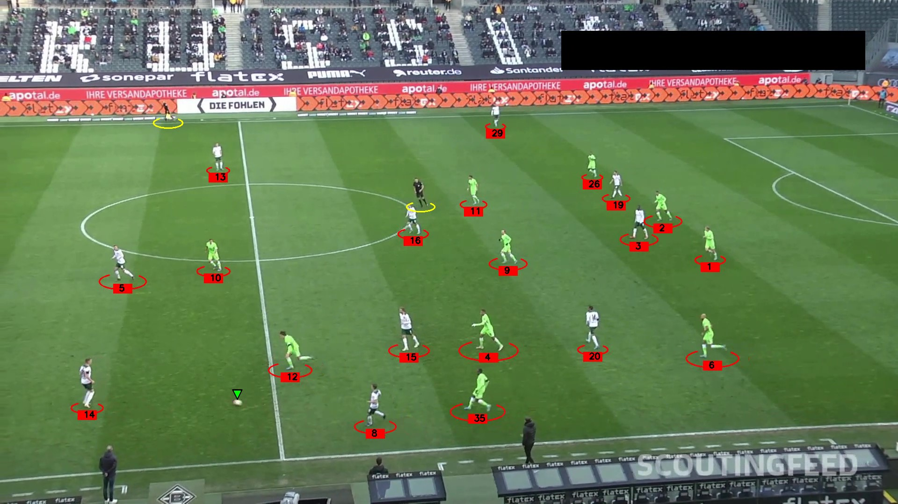

# Football Analysis

## Introduction
In this project, we will build a Football Analysis System from scratch. This project focuses on detecting and tracking players, referees, and the football throughout the entire video using YOLO11.
## Output Videos
Here is a screenshot from one of the output videos:

## Models Used
* Fine-Tuned YOLO11 for player, football and referees detection and tracking

* Trained YOLO11 model for player, football and referees detection and tracking: https://drive.google.com/file/d/1slzfkV2egwx2Rc7xm-csQbG2DGjKrBdB/view?usp=sharing
## Training
* Football Player, Ball and Referees Detection and Tracking with YOLO11: notebook/Football_Analysis_System.ipynb

## Requirements
* python3.11
* ultralytics
* supervision 
* opencv

